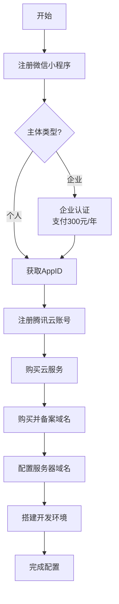
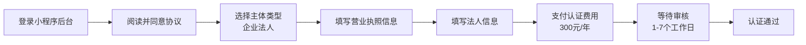

# 微信小程序与腾讯云服务注册指引

本指南帮助您完成"红娘配对"微信小程序的完整注册和配置流程，包括小程序账号申请、腾讯云服务开通、域名配置和开发环境搭建。

## 目录

- [一、整体流程概览](#一整体流程概览)
- [二、微信小程序注册与认证](#二微信小程序注册与认证)
- [三、腾讯云账号开通与服务选购](#三腾讯云账号开通与服务选购)
- [四、服务器域名配置](#四服务器域名配置)
- [五、小程序开发环境配置](#五小程序开发环境配置)
- [六、常见问题与注意事项](#六常见问题与注意事项)

---

## 一、整体流程概览

以下是完成注册和配置的整体流程：



---

## 二、微信小程序注册与认证

### 2.1 注册前准备

根据您的主体类型，准备相应的材料：

| 主体类型 | 必备材料 | 认证要求 | 功能限制 |
|---------|---------|---------|---------|
| **个人** | 未占用邮箱、身份证、管理员手机号、本人微信 | 无需认证 | 支付、获取用户手机号等高级功能受限 |
| **企业** | 营业执照、对公账户、法人信息 | 需认证（300元/年） | 功能完整，可开通所有接口 |

> **建议**：对于"红娘配对"这类需要支付和获取用户手机号的应用，建议使用**企业主体**注册。

### 2.2 注册小程序账号

**步骤**：

1. 访问[微信公众平台](https://mp.weixin.qq.com)
2. 点击右上角"立即注册"
3. 选择账号类型为"小程序"
4. 填写账号信息：
   - 输入未注册过微信任何平台的邮箱
   - 设置密码
5. 登录邮箱，查收激活邮件
6. 填写6位验证码激活账号
7. 选择主体类型（个人/企业）
8. 填写主体信息并完成验证

### 2.3 企业认证流程

如果您选择企业主体，需要完成认证：



**认证步骤**：

1. 登录小程序管理后台
2. 点击"认证"按钮
3. 选择"企业-企业法人"
4. 填写营业执照信息（系统自动读取统一社会信用代码）
5. 填写法人电话、邮箱等信息
6. 使用对公账户支付认证费用
7. 等待腾讯审核

### 2.4 备案要求

根据最新政策，小程序还需要进行**ICP备案**：
- 备案与认证流程配合进行
- 需要提供服务器备案号
- 审核通过后方可正式发布

### 2.5 获取 AppID

注册完成后，获取您的开发者ID：

1. 登录[小程序管理后台](https://mp.weixin.qq.com)
2. 进入 **开发 → 开发管理 → 开发设置**
3. 记录以下信息：
   - **开发者ID（AppID）**：格式如 `wx1234567890abcdef`
   - **开发者密钥**：首次需手动生成，请妥善保存

---

## 三、腾讯云账号开通与服务选购

### 3.1 注册腾讯云账号

**步骤**：

1. 访问[腾讯云官网](https://cloud.tencent.com/)
2. 点击"免费注册"
3. 选择注册方式：
   - 微信扫码注册（推荐）
   - 手机号注册
4. 完成实名认证（需要身份证信息）
5. 完成账号激活

### 3.2 云服务选购清单

根据"红娘配对"小程序的技术架构，建议选购以下服务：

| 服务 | 推荐配置 | 用途 | 参考价格 |
|-----|---------|------|---------|
| **云服务器 CVM** | 2核4G，系统盘50G | 运行 Nest.js 后端服务 | 约 200-400元/月 |
| **云数据库 PostgreSQL** | 2核4G，100G 存储 | 存储用户、配对、聊天数据 | 约 300-500元/月 |
| **云数据库 Redis** | 256MB-1GB 内存 | 缓存、会话存储 | 约 50-150元/月 |
| **对象存储 COS** | 标准存储，按量计费 | 存储用户头像、聊天图片 | 约 0.1元/GB/月 |
| **域名注册** | .com 或 .cn | 小程序访问域名 | 约 50-100元/年 |

> **提示**：新用户通常有优惠活动，可关注腾讯云官方促销页面。

### 3.3 云服务器选购指南

**选择建议**：

- **标准型（S系列）**：均衡的计算、内存和网络资源，适合大多数应用
- **内存型（M系列）**：适合 Redis 等内存密集型服务
- **CPU型（C系列）**：适合计算密集型任务

> 注意：Redis 是内存密集型应用，如单独部署建议选择内存型实例。

### 3.4 购买流程

1. 登录[腾讯云控制台](https://console.cloud.tencent.com/)
2. 进入"产品"页面，选择需要的服务
3. 点击"立即购买"
4. 选择配置：
   - 地域：选择离目标用户最近的区域
   - 实例规格：根据项目需求选择
   - 镜像：建议选择 CentOS 或 Ubuntu
   - 存储：SSD云硬盘
5. 选择购买时长（年付通常有折扣）
6. 确认订单并支付

---

## 四、服务器域名配置

### 4.1 域名购买与备案

**购买域名**：

1. 选择域名注册商（腾讯云、阿里云等）
2. 搜索并选择可用的域名
3. 完成购买

**域名备案**（必需）：

1. 在腾讯云控制台进入"备案管理"
2. 填写主体信息（与小程序主体一致）
3. 上传身份证/营业执照等材料
4. 提交备案申请
5. 等待管局审核（通常7-20个工作日）

> **重要**：小程序要求服务器域名必须完成 ICP 备案。

### 4.2 配置 SSL 证书

小程序要求使用 HTTPS 协议，需要配置 SSL 证书：

1. 在腾讯云控制台进入"SSL证书"
2. 申请免费域名验证证书
3. 选择"DNS验证"方式
4. 添加DNS解析记录
5. 等待签发（通常几分钟到几小时）
6. 下载证书并部署到服务器

### 4.3 配置小程序服务器域名

**步骤**：

1. 登录[小程序管理后台](https://mp.weixin.qq.com)
2. 进入 **开发 → 开发管理 → 开发设置**
3. 找到"服务器域名"模块
4. 点击"修改"
5. 添加以下类型的合法域名：

| 域名类型 | 用途 | 示例 |
|---------|------|------|
| **request合法域名** | `wx.request`、`wx.uploadFile`、`wx.downloadFile` | `https://api.yourdomain.com` |
| **socket合法域名** | `wx.connectSocket` | `wss://socket.yourdomain.com` |
| **uploadFile合法域名** | 图片上传 | `https://upload.yourdomain.com` |
| **downloadFile合法域名** | 文件下载 | `https://cdn.yourdomain.com` |

**注意事项**：

- 域名只支持 HTTPS 协议
- 每个类型最多可配置20个域名
- 一个月内最多可修改5次
- 域名必须完成 ICP 备案

### 4.4 本地开发配置

在开发阶段，可以在微信开发者工具中临时关闭域名验证：

1. 打开微信开发者工具
2. 点击右上角"详情"
3. 在"本地设置"中勾选 **"不校验合法域名、TLS证书、HTTPS证书"**

> **警告**：此设置仅用于开发调试，正式版必须配置合法域名。

---

## 五、小程序开发环境配置

### 5.1 下载安装微信开发者工具

**下载地址**：[微信开发者工具官方下载页面](https://developers.weixin.qq.com/miniprogram/dev/devtools/download.html)

**安装步骤**：

| 操作系统 | 安装说明 |
|---------|---------|
| **Windows** | 双击 .exe 安装包，按向导提示安装 |
| **macOS** | 打开 .dmg 文件，拖拽至"应用程序"文件夹 |

> **注意**：Windows 安装时建议暂时关闭杀毒软件，防止拦截自动更新组件。

### 5.2 创建第一个小程序项目

1. 启动微信开发者工具
2. 使用微信扫码登录
3. 点击左上角"+"或"新建小程序"
4. 填写项目信息：

```yaml
项目名称: 红娘配对
目录: 选择项目存储路径
AppID: 填入获取的AppID（如 wx1234567890abcdef）
后端服务: 不使用云服务（或选择微信云开发）
开发模式: 小程序
模板选择: JavaScript / TypeScript
```

5. 点击"新建"创建项目

### 5.3 项目结构说明

创建完成后，项目结构如下：

```
huashihongniang/
├── pages/                 # 存放所有小程序页面
│   ├── index/            # 首页
│   │   ├── index.wxml   # 页面结构
│   │   ├── index.wxss   # 页面样式
│   │   ├── index.js     # 页面逻辑
│   │   └── index.json   # 页面配置
│   └── profile/         # 个人资料页
├── utils/               # 工具模块
├── components/          # 自定义组件
├── app.js              # 小程序入口文件
├── app.json            # 全局配置文件
├── app.wxss            # 全局样式文件
├── project.config.json # 项目配置文件
└── sitemap.json        # 索引配置文件
```

### 5.4 安装 Vant Weapp 组件库

**步骤**：

1. 打开项目根目录的终端
2. 初始化 npm：

```bash
npm init -y
```

3. 安装 Vant Weapp：

```bash
npm i @vant/weapp -S --production
```

4. 在微信开发者工具中：
   - 点击菜单栏"工具" → "构建 npm"
   - 等待构建完成

5. 在 `app.json` 中引入组件：

```json
{
  "usingComponents": {
    "van-button": "@vant/weapp/button/index",
    "van-cell": "@vant/weapp/cell/index",
    "van-icon": "@vant/weapp/icon/index"
  }
}
```

### 5.5 配置后端 API 请求

创建统一的 API 请求封装：

```javascript
// utils/request.js
const BASE_URL = 'https://api.yourdomain.com';

function request(url, method = 'GET', data = {}) {
  return new Promise((resolve, reject) => {
    wx.request({
      url: `${BASE_URL}${url}`,
      method,
      data,
      header: {
        'content-type': 'application/json',
        'Authorization': wx.getStorageSync('token') || ''
      },
      success: (res) => {
        if (res.statusCode === 200) {
          resolve(res.data);
        } else {
          reject(res);
        }
      },
      fail: reject
    });
  });
}

module.exports = {
  get: (url, data) => request(url, 'GET', data),
  post: (url, data) => request(url, 'POST', data)
};
```

---

## 六、常见问题与注意事项

### 6.1 注册与认证

| 问题 | 解决方案 |
|-----|---------|
| 邮箱已被注册 | 使用未注册过微信任何平台的新邮箱 |
| 企业认证审核失败 | 检查营业执照信息是否正确，确保对公账户信息一致 |
| 认证费用支付失败 | 确保对公账户有足够余额，或联系银行处理 |
| 备案审核时间过长 | 耐心等待管局审核，通常需要7-20个工作日 |

### 6.2 域名配置

| 问题 | 解决方案 |
|-----|---------|
| 域名无法添加到合法域名列表 | 确认域名已完成 ICP 备案，且使用 HTTPS 协议 |
| SSL 证书验证失败 | 检查证书是否正确部署，确保证书链完整 |
| 网络请求失败 | 检查域名是否已添加到合法域名列表，确认服务器配置正确 |

### 6.3 开发环境

| 问题 | 解决方案 |
|-----|---------|
| 项目路径过长导致无法打开 | 将项目放在较短的路径，如 `D:\projects\` |
| 真机预览无法请求数据 | 确认已配置合法域名，或在开发工具中关闭域名校验 |
| npm 构建失败 | 确认已安装 Node.js，尝试删除 node_modules 后重新安装 |

### 6.4 重要提醒

1. **账号安全**：妥善保管 AppID 和 AppSecret，不要泄露给他人
2. **域名配额**：服务器域名一个月内只能修改5次，请谨慎配置
3. **备案要求**：确保域名已完成 ICP 备案，否则小程序无法通过审核
4. **HTTPS 要求**：所有网络请求必须使用 HTTPS 协议
5. **内容审核**：小程序内容和功能需符合微信平台规范
6. **认证续费**：企业认证每年需要续费，请提前安排

---

## 参考资源

- [微信公众平台](https://mp.weixin.qq.com)
- [微信小程序开发文档](https://developers.weixin.qq.com/miniprogram/dev/framework/)
- [腾讯云官网](https://cloud.tencent.com/)
- [腾讯云文档中心](https://cloud.tencent.com/document/product)
- [微信开放社区](https://developers.weixin.qq.com/community)
- [微信官方帮助文档](https://kf.qq.com/faq/170109iQBJ3Q170109JbQfiu.html)

---

**文档版本**: 1.0
**最后更新**: 2026-02-28
