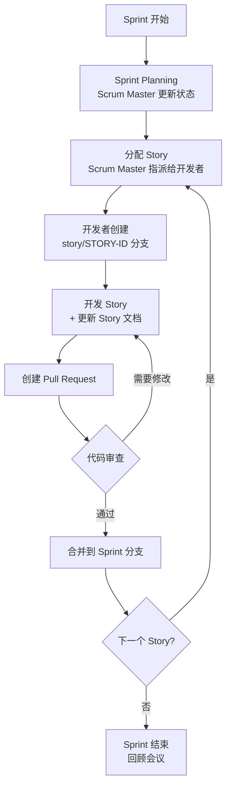
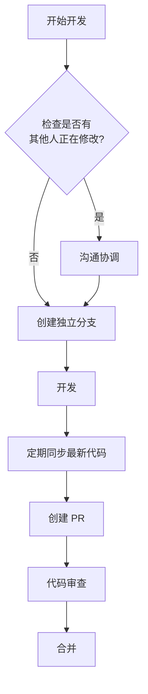
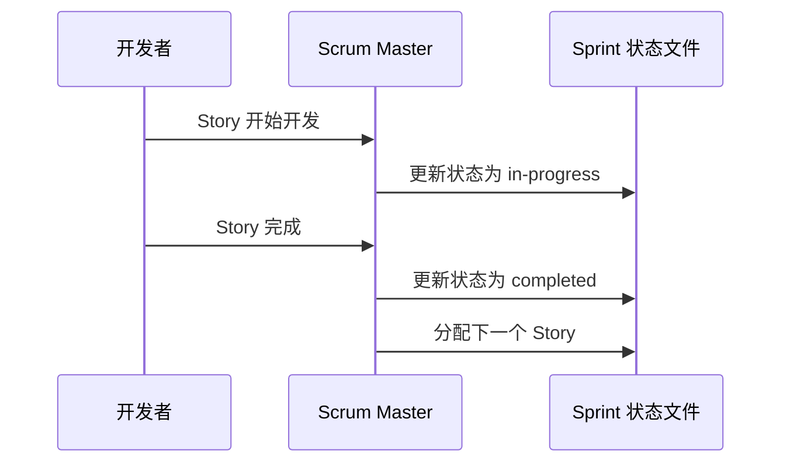

# 团队协作规范文档

本文档定义了"红娘配对"项目组的 Git 协作规则、工作流程和权限管理规范。所有项目组成员**必须严格遵守**。

---

## 目录

- [一、项目仓库结构](#一项目仓库结构)
- [二、角色与权限](#二角色与权限)
- [三、分支管理策略](#三分支管理策略)
- [四、工作流程](#四工作流程)
- [五、Story 开发规范](#五story-开发规范)
- [六、冲突处理](#六冲突处理)
- [七、提交规范](#七提交规范)
- [八、代码审查](#八代码审查)

---

## 一、项目仓库结构

### 1.1 目录说明

```
huashihongniang/
├── _bmad/                              # BMAD 框架配置（所有成员只读）
├── _bmad-output/
│   ├── planning-artifacts/             # 规划文档（所有成员只读）
│   │   ├── prd.md                      # 产品需求文档
│   │   ├── architecture.md             # 架构设计文档
│   │   ├── epics-and-stories.md        # Epic 和 Story 列表
│   │   └── wechat-registration-guide.md # 微信注册指引
│   └── implementation-artifacts/        # 实施工件（详见权限说明）
│       ├── sprint-status.yaml           # Sprint 状态（仅 Scrum Master 可写）
│       ├── stories/                     # Story 文档（开发者各自负责）
│       └── retrospectives/              # 回顾文档（所有成员只读）
├── docs/                                # 项目文档（所有成员只读）
├── src/                                 # 源代码
│   ├── miniprogram/                     # 小程序前端
│   └── backend/                         # 后端服务
├── .gitignore                           # Git 忽略配置
├── README.md                            # 项目说明
└── TEAM_COLLABORATION_GUIDE.md          # 本文档
```

### 1.2 目录权限矩阵

| 目录 | 项目负责人 | Scrum Master | 开发者 | 说明 |
|-----|-----------|--------------|--------|------|
| `_bmad/` | ✅ 读写 | 📖 只读 | 📖 只读 | BMAD 框架配置 |
| `planning-artifacts/` | ✅ 读写 | 📖 只读 | 📖 只读 | 规划文档 |
| `sprint-status.yaml` | ✅ 读写 | ✅ 读写 | 📖 只读 | Sprint 状态 |
| `stories/` | ✅ 读写 | ✅ 读写 | ⚠️ 自己的 Story | Story 文档 |
| `retrospectives/` | ✅ 读写 | ✅ 读写 | 📖 只读 | 回顾文档 |
| `src/` | ✅ 读写 | ✅ 读写 | ✅ 读写 | 源代码 |

---

## 二、角色与权限

### 2.1 项目负责人（Rose）

**职责**：
- 项目整体规划和决策
- BMAD 框架配置管理
- 产品需求文档（PRD）维护
- 架构设计文档维护
- Epic 和 Story 列表管理
- 代码审查（Code Review）
- 发布决策

**权限**：
- 所有目录的读写权限
- 合并代码到 `main` 分支
- 创建和管理里程碑

### 2.2 Scrum Master

**职责**：
- Sprint 计划和组织
- Sprint 状态文件维护
- Story 分配和跟踪
- 代码审查协调
- 冲突解决
- 回顾会议组织

**权限**：
- `sprint-status.yaml` 读写权限
- `stories/` 目录读写权限
- 所有 Story 文档读写权限
- 代码审查权限

### 2.3 开发者

**职责**：
- 按照分配的 Story 进行开发
- 编写和测试代码
- 维护自己负责的 Story 文档
- 参与代码审查
- 参与 Sprint 回顾

**权限**：
- 自己负责的 Story 文档读写权限
- 其他 Story 文档只读权限
- `src/` 目录读写权限
- 创建和提交代码到自己的分支

---

## 三、分支管理策略

### 3.1 分支结构

```
main                          # 主分支（生产环境）
  ├── feature/sprint-N        # Sprint 功能分支
  │   ├── story/STORY-ID      # Story 开发分支
  │   └── story/STORY-ID      # Story 开发分支
  ├── feature/architecture    # 架构分支
  └── hotfix/BUG-ID           # 紧急修复分支
```

### 3.2 分支命名规范

| 分支类型 | 命名格式 | 示例 |
|---------|---------|------|
| **Sprint 功能分支** | `feature/sprint-N` | `feature/sprint-1` |
| **Story 开发分支** | `story/STORY-ID` | `story/EPIC-01-user-auth` |
| **架构分支** | `feature/architecture` | `feature/architecture` |
| **紧急修复分支** | `hotfix/BUG-ID` | `hotfix/login-crash` |
| **发布分支** | `release/vX.Y.Z` | `release/v1.0.0` |

### 3.3 分支保护规则

| 分支 | 保护规则 |
|-----|---------|
| `main` | 🔒 **受保护**：禁止直接推送，必须通过 PR |
| `feature/sprint-N` | ⚠️ 需要 PR 审查后合并到 `main` |
| `story/*` | ✅ 开发者可以自由推送 |

---

## 四、工作流程

### 4.1 Sprint 开发流程



### 4.2 开发者日常流程

```bash
# 1. 拉取最新代码
git checkout main
git pull origin main

# 2. 创建 Story 分支
git checkout -b story/EPIC-01-user-auth

# 3. 开发和测试
# ... 编写代码 ...
# ... 更新 Story 文档 ...

# 4. 提交代码
git add .
git commit -m "feat: 实现用户认证功能

- 完成微信授权登录
- 添加 JWT 认证中间件
- 更新 Story 文档

Story: EPIC-01-user-auth"

# 5. 推送到远程
git push origin story/EPIC-01-user-auth

# 6. 创建 Pull Request
# 在 GitHub 上创建 PR 到 feature/sprint-N

# 7. 等待代码审查
# 根据反馈修改代码

# 8. PR 合并后删除分支
git checkout main
git branch -d story/EPIC-01-user-auth
```

---

## 五、Story 开发规范

### 5.1 Story 文档位置

Story 文档位于：`_bmad-output/implementation-artifacts/stories/`

命名格式：`{EPIC-ID}-{STORY-NAME}.md`

示例：
```
stories/
├── EPIC-01-user-auth.md           # 用户认证
├── EPIC-01-user-profile.md        # 用户资料
├── EPIC-02-matching-list.md       # 推荐列表
└── EPIC-03-chat-service.md        # 聊天服务
```

### 5.2 Story 文档结构

每个 Story 文档必须包含以下部分：

```markdown
---
story_id: EPIC-01-user-auth
title: 实现用户认证功能
assignee: 开发者姓名
status: in-progress
priority: high
---

# Story: 用户认证功能

## 描述
实现微信授权登录和 JWT 认证功能。

## 验收标准
- [ ] 用户可以通过微信授权登录
- [ ] 登录后获取 JWT Token
- [ ] Token 可以正确验证用户身份

## 技术实现
- 微信授权 API
- JWT 生成和验证
- 认证中间件

## 开发日志
- 2026-02-28: 开始开发
- 2026-03-01: 完成微信授权
```

### 5.3 Story 开发规则

| 规则 | 说明 |
|-----|------|
| **单一责任人** | 每个 Story 只有一个开发者负责 |
| **文档同步更新** | 代码和文档同时更新 |
| **禁止修改他人 Story** | 未经允许不得修改其他人的 Story 文档 |
| **完成标记** | Story 完成后更新状态为 `completed` |

---

## 六、冲突处理

### 6.1 冲突场景

| 场景 | 解决方案 |
|-----|---------|
| **两人同时修改同一文件** | 使用独立分支，通过 PR 合并 |
| **Story 文档冲突** | 只修改自己的 Story，沟通后解决 |
| **Sprint 状态冲突** | 只有 Scrum Master 可以修改 |

### 6.2 冲突解决步骤

```bash
# 1. 拉取最新代码
git pull origin main

# 2. 如果有冲突，Git 会提示
# Auto-merging file.txt
# CONFLICT (content): Merge conflict in file.txt

# 3. 打开冲突文件，查找冲突标记
<<<<<<< HEAD
你的代码
=======
别人的代码
>>>>>>> main-branch

# 4. 手动解决冲突（保留正确的代码）

# 5. 标记冲突已解决
git add file.txt

# 6. 完成合并
git commit
```

### 6.3 冲突预防



---

## 七、提交规范

### 7.1 提交信息格式

使用 [Conventional Commits](https://www.conventionalcommits.org/) 规范：

```
<类型>(<范围>): <描述>

[可选的正文]

[可选的脚注]
```

### 7.2 提交类型

| 类型 | 说明 | 示例 |
|-----|------|------|
| `feat` | 新功能 | `feat(auth): 添加微信登录` |
| `fix` | 修复 Bug | `fix(api): 修复用户数据解析错误` |
| `docs` | 文档更新 | `docs: 更新 API 文档` |
| `style` | 代码格式 | `style: 统一代码缩进` |
| `refactor` | 重构 | `refactor(match): 优化匹配算法` |
| `test` | 测试 | `test(auth): 添加认证测试` |
| `chore` | 构建/工具 | `chore: 更新依赖版本` |

### 7.3 提交示例

```bash
# 好的提交
git commit -m "feat(auth): 实现微信授权登录

- 完成微信授权 API 调用
- 添加 JWT Token 生成
- 实现认证中间件

Closes #EPIC-01-user-auth"

# 不好的提交
git commit -m "update"
git commit -m "fix bug"
git commit -m "done"
```

### 7.4 提交频率

- ✅ **频繁提交**：每完成一个小功能就提交
- ✅ **原子提交**：每次提交只做一件事
- ❌ **避免巨型提交**：不要一次提交太多文件

---

## 八、代码审查

### 8.1 Pull Request 要求

每个 PR 必须包含：

| 项目 | 要求 |
|-----|------|
| **标题** | 清晰描述变更内容 |
| **描述** | 关联 Story ID，说明实现的功能 |
| **代码审查者** | 至少一人审查 |
| **测试** | 通过所有测试 |
| **文档** | 更新相关文档 |

### 8.2 PR 模板

```markdown
## 变更说明
<!-- 描述这个 PR 做了什么 -->

## 关联 Story
<!-- 关联的 Story ID，如 #EPIC-01-user-auth -->

## 变更类型
- [ ] 新功能
- [ ] Bug 修复
- [ ] 重构
- [ ] 文档更新

## 测试情况
- [ ] 单元测试通过
- [ ] 手动测试通过
- [ ] 已更新文档

## 截图（如有）
<!-- 添加相关截图 -->

## 审查要点
<!-- 需要审查者特别关注的地方 -->
```

### 8.3 代码审查清单

审查者需要检查：

- [ ] 代码符合项目规范
- [ ] 没有明显的 Bug
- [ ] 有适当的错误处理
- [ ] 代码可读性好
- [ ] 有必要的注释
- [ ] 测试覆盖充分
- [ ] 文档已更新
- [ ] 没有引入安全漏洞

---

## 九、Sprint 状态管理

### 9.1 Sprint 状态文件

位置：`_bmad-output/implementation-artifacts/sprint-status.yaml`

**权限**：只有 Scrum Master 和项目负责人可以修改

**状态值**：
- `planning`: 计划中
- `in-progress`: 进行中
- `completed`: 已完成
- `blocked`: 阻塞

### 9.2 状态更新流程



---

## 十、紧急情况处理

### 10.1 Hotfix 流程

对于生产环境的紧急修复：

```bash
# 1. 从 main 创建 hotfix 分支
git checkout main
git pull origin main
git checkout -b hotfix/login-crash

# 2. 快速修复问题
# ... 修复代码 ...

# 3. 提交并推送
git commit -m "hotfix: 修复登录崩溃问题"
git push origin hotfix/login-crash

# 4. 创建 PR（需要快速审查）
# 5. 合并到 main
# 6. 打标签
git tag -a v1.0.1 -m "Hotfix: 修复登录崩溃"
git push origin v1.0.1
```

### 10.2 回滚流程

如果发布后发现问题：

```bash
# 1. 找到要回滚的版本
git log --oneline

# 2. 回滚到指定版本
git revert <commit-hash>

# 3. 推送回滚
git push origin main
```

---

## 十一、违规处理

### 11.1 违规行为

以下行为被视为违规：

| 违规行为 | 后果 |
|---------|------|
| 未经允许修改他人 Story | 警告，第二次移除项目 |
| 直接推送到 `main` 分支 | PR 被拒绝，重新走流程 |
| 不提交代码审查代码 | 代码不会被合并 |
| 频繁制造冲突 | 培训，改进工作流程 |
| 泄露敏感信息 | 立即移除项目 |

### 11.2 申诉流程

如果对处罚有异议：
1. 向项目负责人提交书面申诉
2. 项目负责人在 3 个工作日内回复
3. 仍有异议可发起团队投票

---

## 十二、工具和资源

### 12.1 必备工具

| 工具 | 用途 | 下载 |
|-----|------|------|
| Git | 版本控制 | https://git-scm.com/ |
| GitHub | 代码托管 | https://github.com/ |
| VS Code | 代码编辑器 | https://code.visualstudio.com/ |
| 微信开发者工具 | 小程序开发 | https://developers.weixin.qq.com/ |

### 12.2 学习资源

- [Git 官方文档](https://git-scm.com/doc)
- [GitHub Flow 指南](https://guides.github.com/introduction/flow/)
- [Conventional Commits](https://www.conventionalcommits.org/)
- [本项目的 BMAD 配置](../_bmad/)

---

## 十三、常见问题 FAQ

### Q1: 我不小心修改了别人的 Story 怎么办？

**A**: 立即通知相关人员，使用 `git checkout -- filename` 恢复文件。

### Q2: 代码冲突如何解决？

**A**: 参考本文档"六、冲突处理"章节，或联系 Scrum Master 协助。

### Q3: 可以跳过代码审查直接合并吗？

**A**: 不可以。所有代码必须经过审查才能合并到 `main` 分支。

### Q4: Story 完成后需要做什么？

**A**:
1. 更新 Story 文档状态为 `completed`
2. 提交 PR 并通过代码审查
3. 通知 Scrum Master 更新 Sprint 状态

### Q5: 如何获取帮助？

**A**:
- 技术问题：联系 Scrum Master 或项目负责人
- 流程问题：查阅本文档或询问项目负责人
- 工具问题：查阅工具官方文档

---

## 附录

### A. Git 常用命令速查

```bash
# 查看状态
git status

# 查看分支
git branch -a

# 创建并切换分支
git checkout -b branch-name

# 添加文件
git add .
git add filename

# 提交
git commit -m "message"

# 推送
git push origin branch-name

# 拉取最新代码
git pull origin main

# 合并分支
git merge branch-name

# 删除分支
git branch -d branch-name

# 查看历史
git log --oneline --graph
```

### B. 联系方式

| 角色 | 姓名 | GitHub | 邮箱 |
|-----|------|--------|------|
| 项目负责人 | Rose | @lee-liao | lee.liao@gmail.com |
| Scrum Master | （待定） | | |

---

**文档版本**: 1.0
**最后更新**: 2026-02-28
**下次审查**: 每次 Sprint 回顾会议

---

> 💡 **提示**：本文档会根据项目发展持续更新。请定期查看最新版本。
